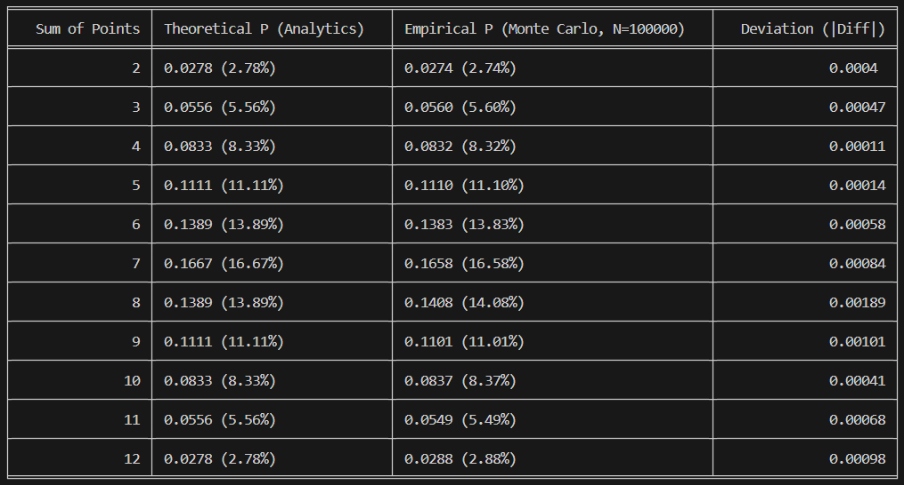

### Analysis of Dice Roll Probability Simulation (Monte Carlo Method)

The following table summarizes the probabilities derived from the analytical model vs the simulation results:

- The maximum observed absolute deviation (∣Diff∣) is only 0.00189. This vary small error confirms that the Monte Carlo simulation accurately modeled the random process of throwing two dice.
- With N=100_000 iterations, the empirical probabilities effectively almost converged to the theoretical probabilities. This result confirms that as the number of trials increases, the empirical average approaches the expected theoretical value.
- The sum of 7 remains the most probable outcome (approx. 16.6%), as expected, due to having the highest number of combinations.
- The sums of 2 and 12 remain the least probable outcomes (approx. 2.78%).

In conclusion, the calculations are correct, and the simulation is a highly successful application of the Monte Carlo method for approximating probability distributions.
